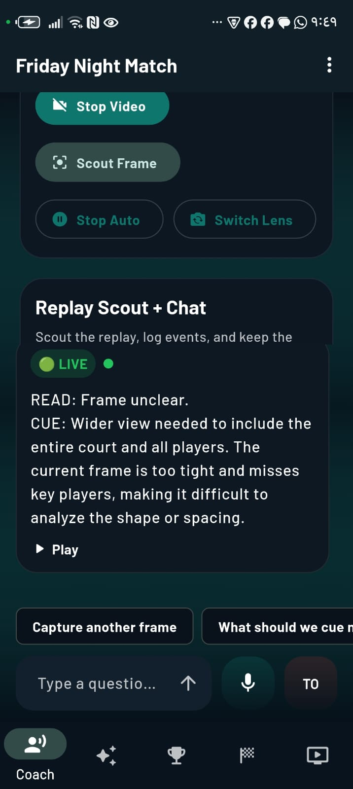
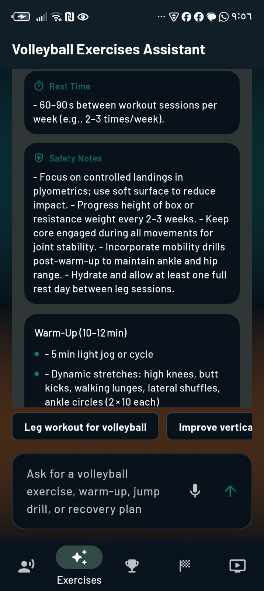
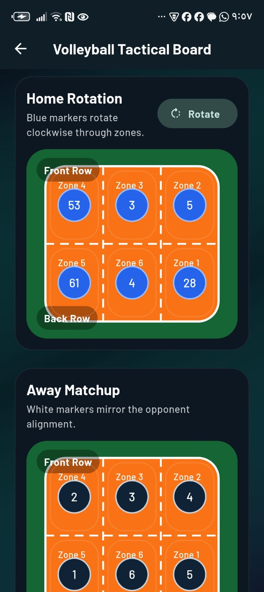
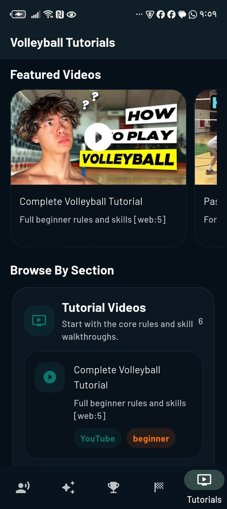
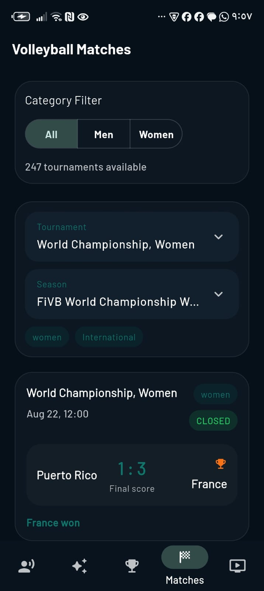

# Volleyball Stats

`vollyball_stats` is a Flutter app for volleyball coaches and players that combines live voice coaching, AI-generated exercise plans, tactical tools, tutorials, and match browsing in one mobile experience.

The app is built around a coaching-first workflow:

- Start or resume a match session
- Ask the AI coach questions by text or voice
- Scout live frames or uploaded replay video
- Review tutorials, drills, competitions, and match data

## Features

- AI voice coach for live match conversations
- Text and voice input for coaching questions
- Live video scouting with camera-based frame analysis
- Replay scouting from uploaded match clips
- Local session history with saved chat and match state
- Reset chat support during live coaching sessions
- AI exercises assistant for workout and drill ideas
- Volleyball tutorials and drill collections
- Tactical board for court planning and positioning
- Competitions and matches browsing powered by Sportradar

## App Sections

- `Coach`: match setup, live coaching chat, live video scout, replay scout, alerts, follow-ups, and saved session history
- `Exercises`: AI assistant for workouts, warm-ups, jump drills, agility sessions, and recovery guidance
- `Competitions`: browse volleyball competitions
- `Matches`: explore seasons, fixtures, and published match results
- `Tutorials`: open curated tutorials and drill resources

## Screenshots

<table>
  <tr>
    <td align="center">
      <strong>Splash</strong><br />
      
    </td>
    <td align="center">
      <strong>Coach Welcome</strong><br />
      
    </td>
  </tr>
  <tr>
    <td align="center">
      <strong>Live Coaching</strong><br />
      
    </td>
    <td align="center">
      <strong>Exercises Assistant</strong><br />
      
    </td>
  </tr>
  <tr>
    <td align="center">
      <strong>Exercises Chat</strong><br />
      
    </td>
    <td align="center">
      <strong>Tactical Board</strong><br />
      
    </td>
  </tr>
  <tr>
    <td align="center">
      <strong>Tutorials</strong><br />
      
    </td>
    <td align="center">
      <strong>Passing Tutorial</strong><br />
      
    </td>
  </tr>
  <tr>
    <td align="center">
      <strong>Drill Collections</strong><br />
      
    </td>
    <td align="center">
      <strong>Matches</strong><br />
      
    </td>
  </tr>
</table>

## Tech Stack

- Flutter
- Dart
- Riverpod
- Hive
- HTTP and Dio
- `speech_to_text`
- `flutter_tts`
- `camera`
- `video_player`
- Hugging Face Inference API
- Sportradar volleyball data APIs

## Getting Started

### 1. Install dependencies

```bash
flutter pub get
```

### 2. Create a root `.env` file

Add the environment variables the app expects:

```env
HF_TOKEN=your_hugging_face_token
SPORTRADAR_API_KEY=your_sportradar_api_key
```

Notes:

- `HF_TOKEN` enables the voice coach and exercises assistant
- `SPORTRADAR_API_KEY` enables competitions and matches data
- If one key is missing, the rest of the app can still open, but the related features will be limited

### 3. Run the app

```bash
flutter run
```

## Permissions

Depending on the feature you use, the app may request:

- Microphone permission for voice coaching
- Camera permission for live scouting
- File access for replay video uploads
- Network access for AI and volleyball data requests

## Project Structure

```text
lib/
  features/
    ai_chat/
    home/
    matches/
    tactical_board/
    tournaments/
    tutorials/
    voice_coach/
```

## Notes

- Voice coach sessions are stored locally with Hive
- Live coaching supports text, voice, and visual scouting flows
- The project title in code is `vollyball_stats`, but the app experience is focused on volleyball coaching and stats
